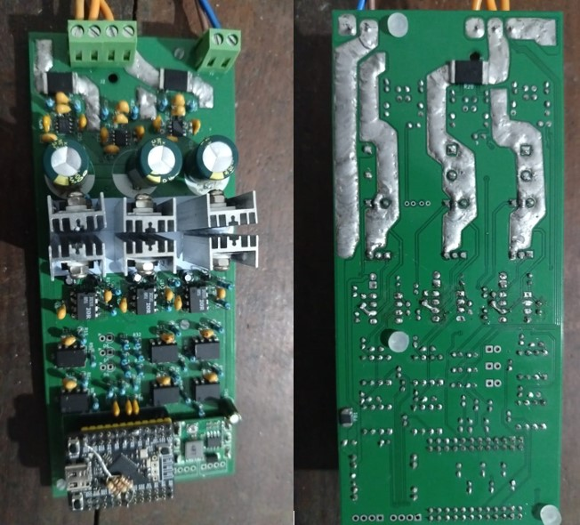

# Hardware Engineering & Power Stage Architecture

This directory contains the schematic and PCB layout for the bare-metal STM32G431 ESC, designed specifically for high-frequency sensorless FOC.

## Power Stage & Isolation Topology
* **Gate Drivers:** Discrete IR2101 drivers pushing IRFZ44N MOSFETs.
* **Galvanic Isolation:** High-speed 6N137 optocouplers isolate the logic layer (STM32) from the power stage to prevent ground bounce and protect against high *di/dt* switching noise.
* **Power Management:** MP1584 Buck converter stepping the main 12V bus down to a stable 5V for logic and gate driver staging.

## Switching Dynamics & Thermal Constraints
The hardware was simulated and validated against exact MOSFET switching characteristics:
* **Miller Plateau Management:** Gate charge limits and switching losses were modeled at varying drive currents to optimize the transition through the Miller Plateau.
* **Shoot-Through Protection:** Hardware deadtime is physically characterized at 1.9 μs to ensure absolute safe-state switching during high/low side handoffs.

## Signal Conditioning & Analog Front End (AFE)
* **Current Sensing:** Low-side current measurement utilizing 2 mΩ shunts paired with AD8418 current sense amplifiers for precision synchronous sampling.
* **BEMF Sensing:** Phase voltages (A, B, C) are stepped down via precise resistor divider networks (10k/1k).
* **Hardware Filtering:** The BEMF signals pass through dedicated RC low-pass filters tuned to a 172.1 kHz cutoff frequency, resulting in a known, deterministic 7.9° phase lag that is compensated for in software. 
